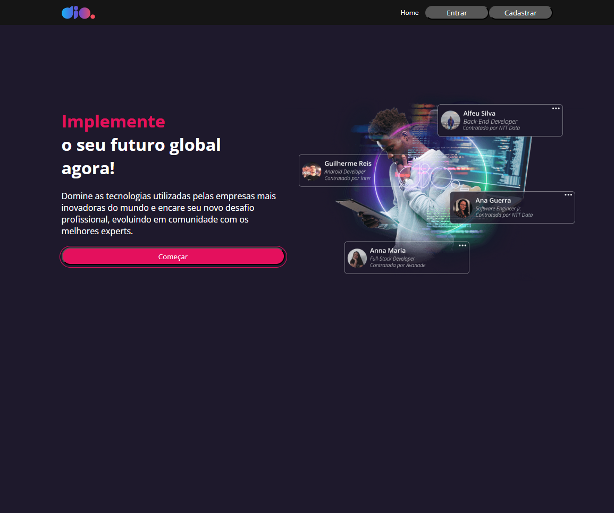

<h1 align="center">Landing Page DIO - Trilha React </h1>

O Projeto consiste na aplicação de uma Landing Page da DIO.

## Súmario

- [✨ Features](#features)
- [🏆 Sobre](#sobre)

<h2 id="features">✨ Features </h2>

- React
- HTML
- CSS
- Styled Components
- JavaScript
- Material UI
- React Routes
- React Hooks Forms
- Axios
- Json Server

<h2 id="sobre">🏆 Sobre</h2>

Esse projeto foi construído durante da trilha de React da DIO, colocando como desafio os conceitos de Hooks, Estados, componentes e outras coisas, durante a construção do projeto foi elaborada a nossa página principal, páginas de Login e Cadastro e um Feed para quando o usuário estiver logado. Toda estilização da página foi feita utilizando o Styled-Components.
